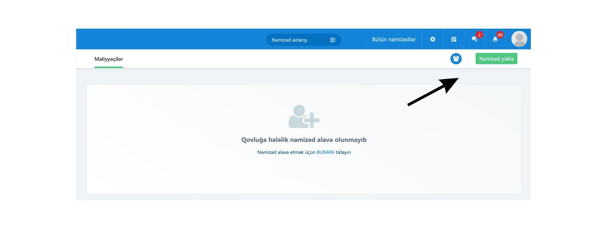
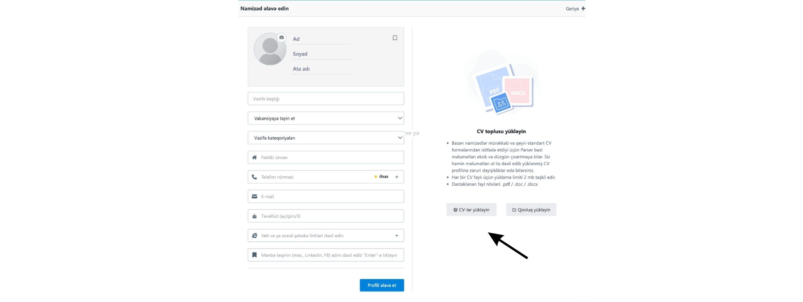
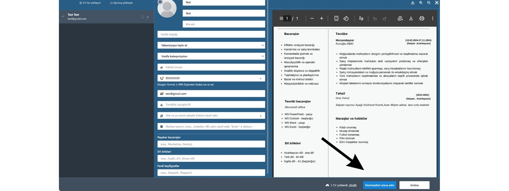

# CV-ləri sistemə yüklənməsi

Qovluğa daxil olduqdan sonra:

1. **Namizəd yüklə** düyməsini klikləyin.

<figure><figcaption></figcaption></figure>

1. **CV-ləri yüklə** seçimini edin.

<figure><figcaption></figcaption></figure>

1. Kompüterinizdən istədiyiniz sayda CV seçin.

Sistem eyni anda çoxsaylı CV qəbul edir.

**Qeyd:**

* Bəzi mürəkkəb və ya qeyri-standart CV formatlarında Parser məlumatları natamam və ya düzgün oxumaya bilər. Bu halda namizəd profilindəki məlumatları manual olaraq redaktə edə bilərsiniz.
* Hər bir CV faylı üçün maksimum yükləmə həcmi **2 MB** təşkil edir.
* Dəstəklənən fayl formatları: **.pdf**, **.doc**, **.docx**.
* İstəyinizə uyğun olaraq namizədi **manual** şəkildə də əlavə edə bilərsiniz.

CV yükləndikdən sonra sistem məlumatları avtomatik oxuyaraq namizəd profilini yaradır.

<figure><figcaption></figcaption></figure>

Məlumatları yoxladıqdan sonra **Əlavə et** düyməsini klikləyin.

<figure><figcaption></figcaption></figure>

Bundan əlavə, bu səhifədə aşağıdakı əməliyyatları da edə bilərsiniz:

* İstəmədiyiniz namizədi isə sətirin sağ tərəfində yerləşən **Sil** düyməsi ilə siyahıdan çıxara bilərsiniz.
* **CV əlavə et** – əlavə CV-lər yükləmək üçün;
* **Qovluqdan əlavə et** – mövcud qovluqdakı namizədləri əlavə etmək üçün;

