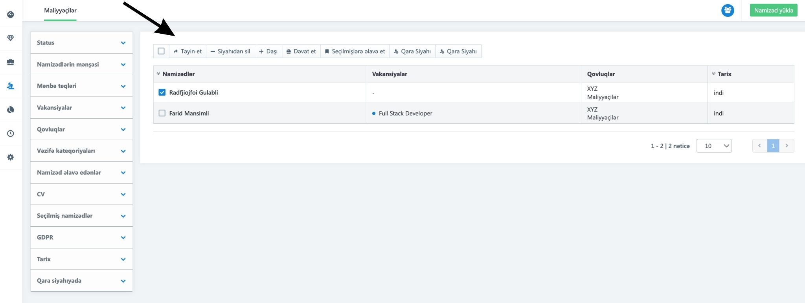

# Namizədin vakansiyaya təyin edilməsi

Namizəd yaradıldıqdan sonra onu istənilən vakansiyaya təyin edə bilərsiniz.

Bunun üçün:

1. Namizədi seçin.
2. &#x20;**Təyin et** seçimini edin.

<figure><figcaption></figcaption></figure>

3. İstədiyiniz vakansiyanı seçin.

<figure><figcaption></figcaption></figure>

Vakansiya təyin edildikdən sonra həmin namizədin qarşısında hansı vakansiyaya aid olduğu görünəcək.

[Eyni zamanda bu hissədən namizədi digər qovluqlara təyin etmək mümkündür.](namiz-di-dig-r-qovluqlara-lav-edin.md)

